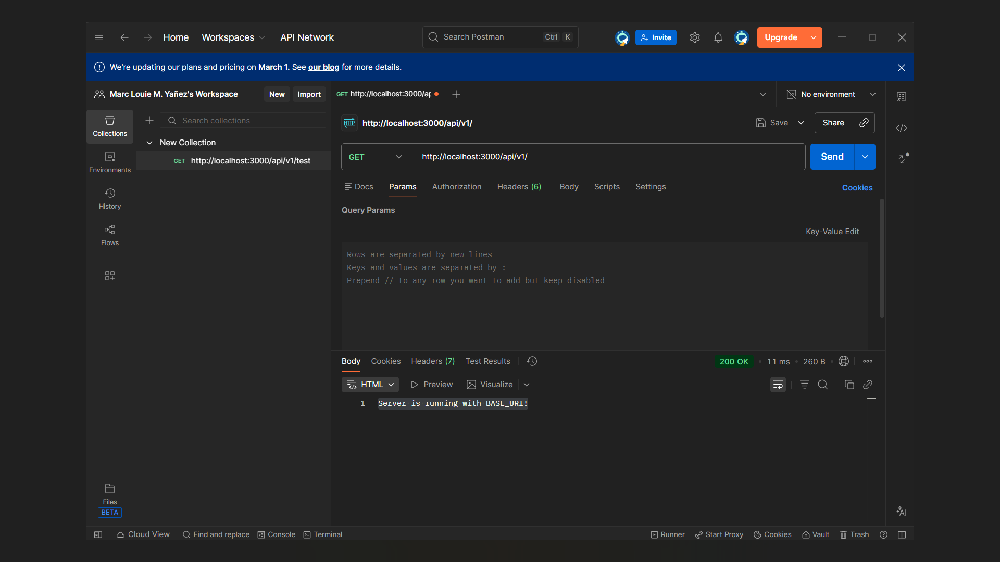

# yanez-api-activity-4
Hands-on Activity #4: Securing the API
# RESTful API Activity - [Marc Louie Yanez]

## Best Practices Implementation

**1. Environment Variables:**
- *Question:* Why did we put `BASE_URI` in `.env` instead of hardcoding it?  
- *Answer:* Using `.env` for `BASE_URI` makes the application configurable and secure. It allows different environments (development, testing, production) to use different API endpoints without changing the code. It also helps prevent sensitive data from being exposed in the source code.

**2. Resource Modeling:**
- *Question:* Why did we use plural nouns (e.g., `/rooms`) for our routes?  
- *Answer:* Plural nouns are used in RESTful APIs to represent collections of resources. For example, `/rooms` refers to the collection of all room objects. This makes the API intuitive and consistent with REST conventions, where `/rooms/1` would refer to a specific room with ID 1.

**3. Status Codes:**
- *Question:* When do we use `201 Created` vs `200 OK`?  
- *Answer:* `201 Created` is used when a new resource has been successfully created, typically in response to a POST request. `200 OK` is used when a request is successful but does not result in a new resource being created, such as fetching data with GET or updating with PUT.

- *Question:* Why is it important to return `404` instead of just an empty array or a generic error?  
- *Answer:* Returning `404 Not Found` clearly communicates that the requested resource does not exist. This prevents confusion with an empty collection (which implies the resource exists but has no items) and provides proper feedback for client applications to handle errors appropriately.

**4. Testing Evidence:**
- **Successful GET Request**  
  

- **Successful POST Request (with token)**  
  

---

## Repository
[GitHub Link](https://github.com/hsmrkyy/yanez-api-activity-4)

---

## Conclusion
This project demonstrates secure API development with authentication, authorization, and best practices implementation. It uses environment variables for configuration, bcrypt for password security, JWT for authentication, and role-based access control for authorization.
